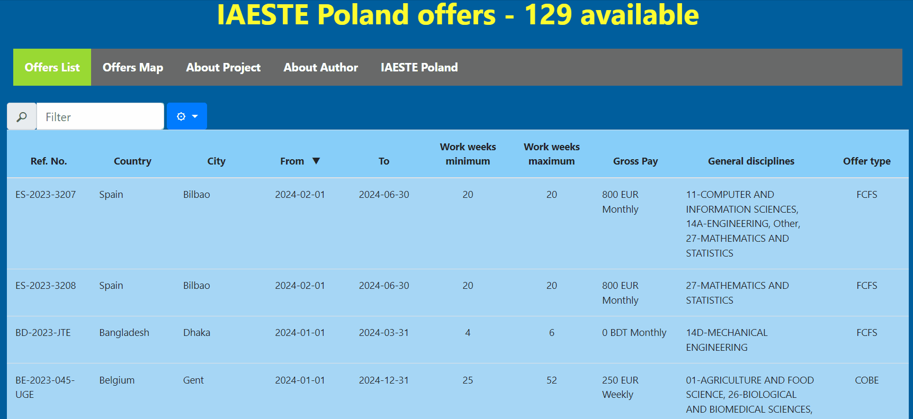
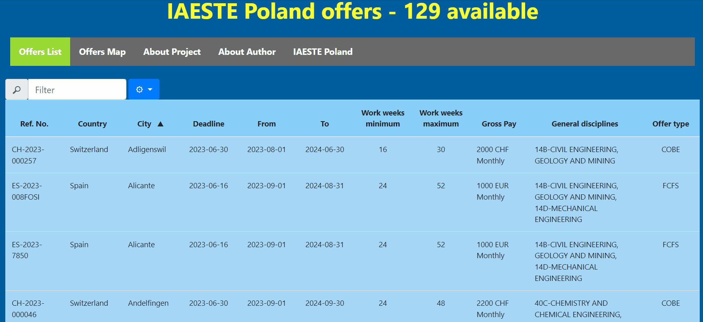
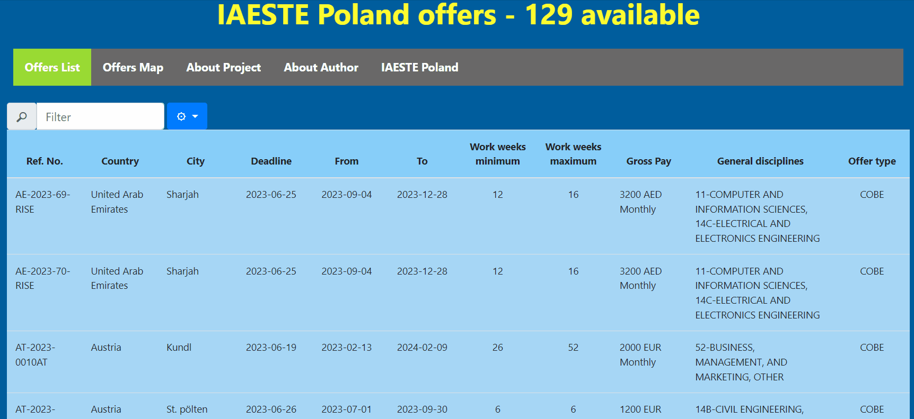

# IAESTE Table offers analyzer - web application using Django framework

Author: **Krzysztof Nazar**

## [Live demo](https://iaestetablebykn.pythonanywhere.com/) of the app
Use [**this link**](https://iaestetablebykn.pythonanywhere.com/) to check the demo of this application hosted by [Pythonanywhere.com](https://pythonanywhere.com).

## The goal of the project
**The goal of this project was to deploy a web application displaying IAESTE Poland offers for international internships. I wanted to make the searching process much more comfortable, faster and easier for the user.**

## IAESTE Association 

"The International Association for the Exchange of Students for Technical Experience, Association sans but lucratif (non-profit association), commonly known as IAESTE A.s.b.l. is an association of national committees representing academic, industrial and student interests. We serve 3500+ students, 3000 employers and 1000 academic institutions through career-focused professional internships abroad, social and intercultural reception programmes, international networking and other career and employer branding activities in more than 80 countries worldwide."

Text source: [link](https://iaeste.org/about)

### IAESTE Poland
The official website of IAESTE Poland is available [here](https://www.iaeste.pl/).

  

Image source: [link](https://www.facebook.com/IaestePoland)

## Main functionalities of the application

The application provides an interface and tools designed for searching specific internship opportunities.

The key functionalities include:

- **Offers List** - This feature allows users to browse through all the currently available internship offers. The table can be sorted and filtered based on various criteria. Additionally, users have the option to choose which columns they want to display.
- **Offers Map** - With this feature, users can visualize the internship offers on an interactive map. A marker is placed on the map for each location where at least one offer is available. By clicking on the marker, the user can access detailed information about the selected offer.

### Selecting columns
**The user can choose and select the columns that are of interest to them.**
This can be done by clicking on the cogwheel icon and selecting the checkboxes corresponding to the desired column names.

### Sorting columns
**The user can sort the columns in the table by clicking on the column header.**
An arrow indicator displays the sorting order, whether it is descending or ascending.

### Search for value in the table
**The user can search (filter) for a specific value in the table by utilizing the search field located at the top.**
If a row in the table doesn't contain the searched value, it will be hidden.

### View offers on map
**The user can utilize an interactive map to discover offers in a particular location.**
The map enables users to view the locations of the offers, with each marker representing a city where available offers are currently present.
Once a marker is clicked, the user can access a popup table displaying the available offers.
Each offer type is distinguished by a different color row in the table.
To obtain specific details about an offer, the user can click on a button with a link to the offer details.

## Why did I create this?

When I heard about IAESTE, I wanted to check their website and see the offers they had. I found only two options:

1. Check PDFs - a single PDF contains information about one offer and before opening the PDF the user knows only the Ref. number of the offer, which is not important information when student is looking for an internship.

2. Use this [spreadsheet](https://iaeste.pl/offers). In my opinion, using it is extremely inconvenient, because the columns cannot be easily sorted or filtered, so the only way to look for offers is by using the "ctrl+f" method.

**Therefore, I created this project - I wanted to make the searching process much more comfortable, faster and easier for the user.**

**This web application is built using the Django framework.**

The major steps in this project were:
 1. Convert the IAESTE [spreadsheet](https://iaeste.pl/offers) into HTML code and extract information about each offer. 
 2. Create a model and database containing the information about the offers.
 3. Display the offers as a table. Each column can be filtered and sorted in ascending and descending order.
 4. Display the offers on an interactive world map. Each pin on the map corresponds to a city where an internship is available. After clicking the pin, a pop-up table appears, and the user can click a link to see details about the specific offer.

## Used libraries
 - Django
 - folium
 - geopy
 - NumPy
 - urllib

## Possible future improvements
Based on my experience while using the app, I thought of adding the following functionalities:
 - **Add more responsive CSS styling** - adjusted for mobile phones

## Contributing

Pull requests are welcome. For major changes, please open an issue first
to discuss what you would like to change.

## License

[MIT](https://choosealicense.com/licenses/mit/)
